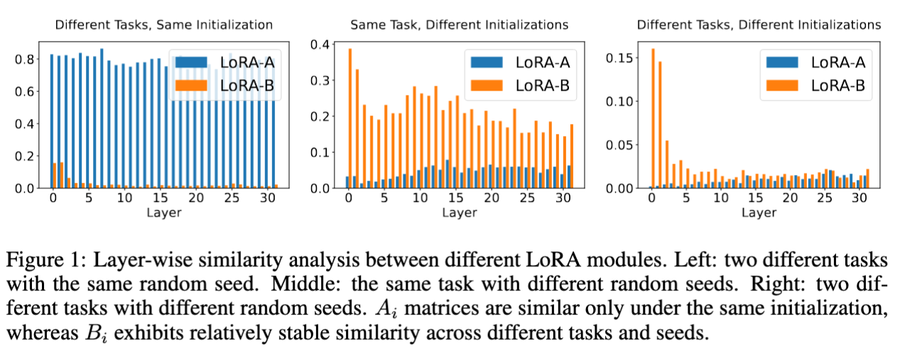
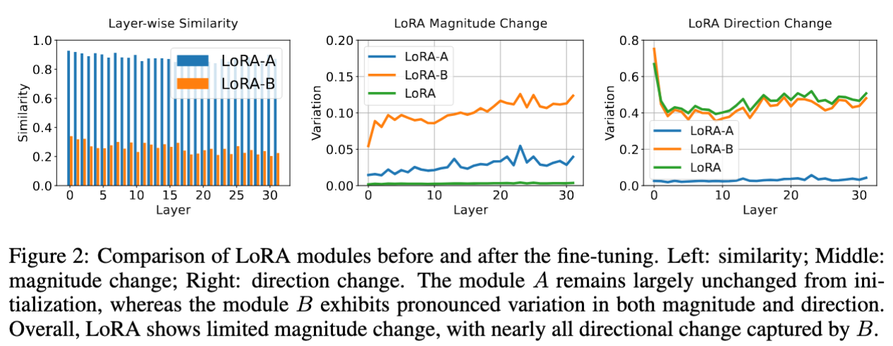
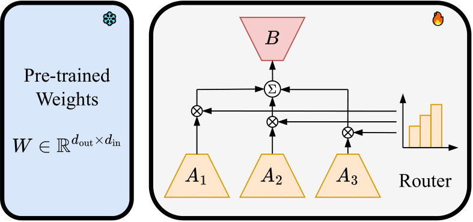
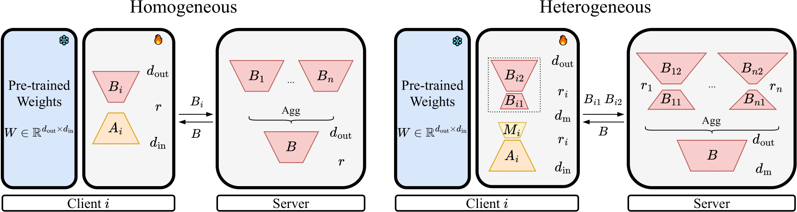

Official implementation of *[Rethinking Parameter Sharing for LLM Fine-Tuning with Multiple LoRAs](https://arxiv.org/abs/2509.25414)*

Previous research has shown that the $A$ matrices from LoRAs fine-tuned on different tasks are often similar. We empirically find that this similarity arises from using the same initialization. When LoRAs share the same initialization, their $A$ matrices remain similar across tasks. In contrast, with different initializations, the $A$ matrices from the same task are not similar. 

  

Furthermore, we analyze the similarity, magnitude, and direction changes of LoRA modules before and after fine-tuning. First, we observe that the $A$ matrix changes very little, whereas the $B$ matrix exhibits substantial variation. Second, LoRA shows only limited changes in magnitude, while most of the directional change is captured by $B$. These findings suggest that $B$ plays a more critical role than $A$ in encoding knowledge.

  

Motivated by these findings, we propose sharing the $B$ matrix during fine-tuning across multiple LoRAs to improve parameter efficiency while preserving knowledge transfer. In multi-task fine-tuning, we propose **ALoRA**, which uses multiple $A$ matrices together with a single shared $B$ matrix. For federated fine-tuning, we introduce **Fed-ALoRA**, which shares only the $B$ matrix for server-side aggregation.

**ALoRA** for multi-task fine-tuning:

  

**Fed-ALoRA** for federated fine-tuning:

  

For multi-task fine-tuning and federated fine-tuning, please refer to each folder for more details.